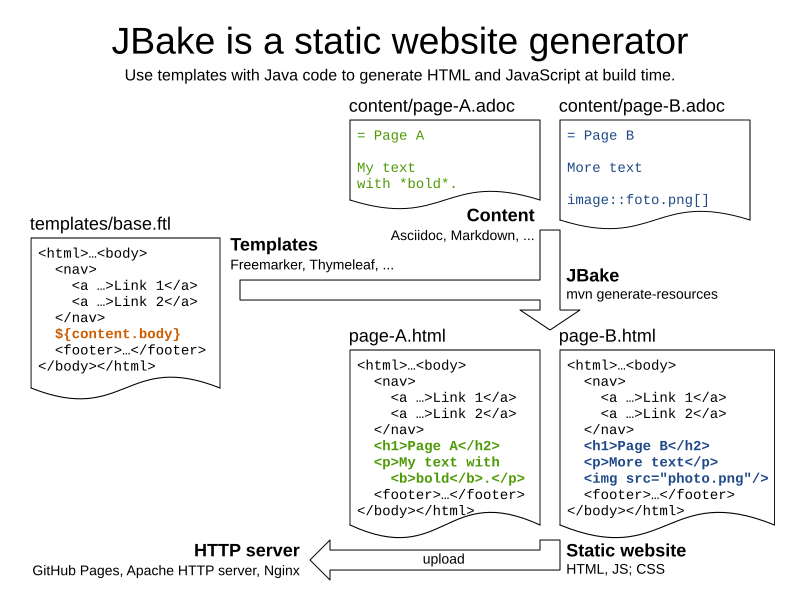

= Generate your static website with Java and JBake

A static website is ideal for a project, a product or personal blog.
It runs on every HTTP server (no server side code execution).
*It's fast. It's stable. Hosting is cheap.* Or even free for projects using https://pages.github.com[Github Pages].

However, writing a website in pure HTML and JavaScript is tedious.
Client-side JavaScript frameworks only go so far.
It's still error prone to copy-paste the menu and footer across multiple HTML files.
And nobody enjoys writing articles or landing pages in pure HTML.

A static website _generator_ has many of the advantages of server side code,
without the performance, stability and hosting challenges.
At build time, it combines code templates with content texts
to output HTML. Just upload the HTML output, and you're done.
Or push the sources to GitHub and have Continuous Integration automatically build and publish it.

== Introducing JBake

https://jbake.org[JBake] is an open source, static website generator written in Java.
It's lead by Jonathan Bullock.
It transforms content and template files into HTML files. For example:

The `base.ftl` template file contains the menu and footer
for every page of this website.
*To add a menu link on every website page,
you only need to adjust that one template file.*
JBake supports https://freemarker.apache.org[Freemarker], Thymeleaf and various other technologies.
Those can call existing Java code, iterate through lists and check `if` conditions.

Typically, the template file(s) also have a `<head>` element that adds
scripts (such as https://analytics.google.com[Google Analytics] to measure visitor count),
JavaScript libraries (such as https://getbootstrap.com[Bootstrap] to build a user-friendly website)
and icon libraries (such as https://fontawesome.com[FontAwesome Free] to make it pretty).

Every output HTML file starts from a content page.
For example, `page-A.html` is the result of transforming `page-A.adoc` through the `base.ftl` template.
Similarly, `page-B.adoc` transforms into `page-B.html`.
To create a new page for your website, create a new content file,
set the `jbake-type` property to reuse your template (such as `base`) and start writing text.
JBake supports https://asciidoctor.org[Asciidoc], Markdown and HTML.
Writing texts and articles in Asciidoc is far productive than in HTML - or even MS Word.

Treat your content and template files just like your `.java` sources:
put them in Git and open them in your favorite IDE.
*For an important website, use Pull Requests to review every change before merging it.*
After all, your website probably has more users than the project or product that its selling.
So it should adhere to at least the same quality standards, no?

== Getting started with JBake

*The best part about JBake is that you don't need to install it.*
You can just build your JBake website with Maven or Gradle, with their JBake plugin.

Try it out for yourself:

. Git clone https://github.com/jbake-org/jbake-example-project-freemarker[the JBake Freemarker example]:
+
----
$ git clone https://github.com/jbake-org/jbake-example-project-freemarker
$ cd jbake-example-project-freemarker
----

. Add in this Maven `pom.xml` file:
+
----
<?xml version="1.0" encoding="UTF-8"?>
<project xmlns="http://maven.apache.org/POM/4.0.0" xmlns:xsi="http://www.w3.org/2001/XMLSchema-instance"
         xsi:schemaLocation="http://maven.apache.org/POM/4.0.0 https://maven.apache.org/xsd/maven-4.0.0.xsd">
  <modelVersion>4.0.0</modelVersion>

  <groupId>org.jbake</groupId>
  <artifactId>jbake-example-project-freemarker</artifactId>
  <packaging>pom</packaging>
  <version>1.0-SNAPSHOT</version>

  <build>
    <plugins>
      <plugin>
        <groupId>org.jbake</groupId>
        <artifactId>jbake-maven-plugin</artifactId>
        <version>0.3.5</version>
        <executions>
          <execution>
            <phase>generate-resources</phase>
            <goals>
              <goal>generate</goal>
            </goals>
          </execution>
        </executions>
        <configuration>
          <inputDirectory>${project.basedir}</inputDirectory>
          <outputDirectory>${project.build.directory}/website</outputDirectory>
        </configuration>
        <dependencies>
          <dependency>
            <groupId>org.jbake</groupId>
            <artifactId>jbake-core</artifactId>
            <version>2.6.7</version>
          </dependency>
          <dependency>
            <groupId>org.freemarker</groupId>
            <artifactId>freemarker</artifactId>
            <version>2.3.31</version>
          </dependency>
          <dependency>
            <groupId>org.asciidoctor</groupId>
            <artifactId>asciidoctorj</artifactId>
            <version>2.4.3</version>
          </dependency>
          <dependency>
            <groupId>com.vladsch.flexmark</groupId>
            <artifactId>flexmark</artifactId>
            <version>0.62.2</version>
          </dependency>
          <dependency>
            <groupId>com.vladsch.flexmark</groupId>
            <artifactId>flexmark-profile-pegdown</artifactId>
            <version>0.62.2</version>
          </dependency>
        </dependencies>
      </plugin>
    </plugins>
  </build>
</project>
----

. Build the website with Maven:
+
----
mvn clean generate-resources
----

. Open `target/website/index.html` in your browser to take a look at the result.
*It just takes a few seconds to build* - even with hundreds of content pages
and dozens of templates.

. Now add a new `.adoc` file in the `content` directory with a new article.
Build again and open that new resulting HTML page.

== Going further with JBake

You can make advanced websites with JBake too.
For example, the project website for https://www.optaplanner.org[OptaPlanner], our open source AI constraint solver,
is completely build with JBake.
The source files for our website are https://github.com/kiegroup/optaplanner-website[here].

=== Macros

It uses `.adoc` content files for complex "use case" pages, such as https://www.optaplanner.org/learn/useCases/vehicleRoutingProblem.html[Vehicle Routing]
and https://www.optaplanner.org/learn/useCases/maintenanceScheduling.html[Maintenance Scheduling].
The `useCaseBase.ftl` template uses a macro to embed YouTube videos:

----
<h1>${content.title}</h1>

    <@macros.videoCard youtubeId=content.featured_youtube_id/>

${content.body}
----

Each use case content page defines their own YouTube video to show,
for example in `maintenanceScheduling.adoc`:

----
= Maintenance scheduling and inspection planning
:jbake-type: useCaseBase
:jbake-featured_youtube_id: dqTrjkVxoPI

Machinery and other types of equipment in use ...
----

The Freemarker macro then renders it (using Bootstrap underneath):

----
<#macro videoCard youtubeId>
   ...
</#macro>
----

=== Data files

JBake 2.7+ (currently RC-5) also supports `yml` data files.
These are useful to list all latest releases, team members, videos, events, customers, etc.
Freemarker can then iterate through those lists to render HTML for each entry.

For example, on that OptaPlanner website, all public speaking events go into the `data/events.yml` file:

----
- eventOrganization: "JFokus"
  eventUrl: https://www.jfokus.se/
  location: Stockholm, Sweden
  date: 2022-02-07
  ...

- eventOrganization: "DevConf.CZ"
  eventUrl: https://www.devconf.cz/
  location: Brno, Czech Republic (virtual)
  date: 2022-01-28
  ...
----

The `latestEvents` macro - which is shown on most pages - renders those events as HTML:

----
<#assign events = data.get('events.yml').data>
<#macro latestEvents>
    <ul>
        <#list events?reverse as event>
            <#if .now?date <= event.date?date>
                <li>
                   <a href="${event.eventUrl}">${event.eventOrganization}</a> 
                   ${event.location} - ${event.date?string("EEE d MMMM yyyy")}
                </li>
            </#if>
        </#list>
    </ul>
</#macro>
----

There is some Freemarker magic in here: `<#list>` iterates through all events
and `<#if>` filters out the future events.

Below Freemarker, it's all Java.
Stacktraces are familiar. Date formatting follows Java APIs.
In the `.ftl` file, you can call any Java method, for example `.substring(...)` on a string.

== Conclusion

A static website generator is quite powerful.
Without paying to run server side code, you can still automate much logic, at build time.
The sources go in version control (such as git).
Continuous Integration can publish it on every change.

Thanks to JBake, the Java ecosystem has a pretty good open source static website generator too.
It runs from Maven or Gradle. That's easy to integrate with CI.
It also ensures everyone uses the same JBake version. https://jbake.org[Try it out.]
